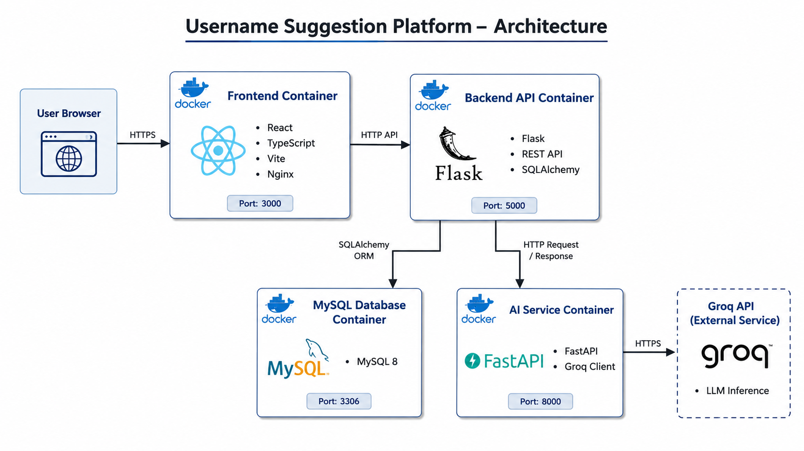

# Username Suggestion Platform

## Author

Pranjit Das

Email: [pranjitd865@gmail.com](mailto:pranjitd865@gmail.com)

GitHub: https://github.com/lazycoder54

---

## Project Overview

This project consists of:

* React + Vite Frontend
* Flask Backend API
* FastAPI AI Service
* MySQL Database
* Groq LLM Integration

---

## Architecture

---

## Tech Stack

Frontend:

* React
* TypeScript
* Vite
* Nginx

Backend:

* Flask
* SQLAlchemy

AI Service:

* FastAPI
* Groq API

Database:

* MySQL 8

Containerization:

* Docker
* Docker Compose

---

## Setup Instructions

### Clone Repository

git clone <https://github.com/lazycoder54/rest-api-project.git>

cd project

### Configure Environment Variables

Create .env file:

GROQ_API_KEY=your_key_here

### Run Application

docker compose up --build

### Services

Frontend:
http://localhost:3000

Backend:
http://localhost:5000

AI Service:
http://localhost:8000/docs

---

## Docker Services

frontend,
backend,
ai-service,
mysql

---

## Assumptions

* Docker Desktop installed
* Internet available for Groq API access

---

